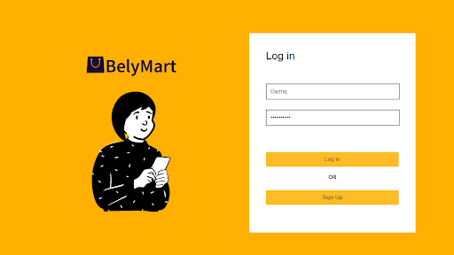
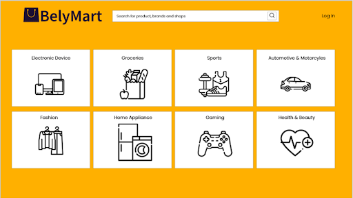
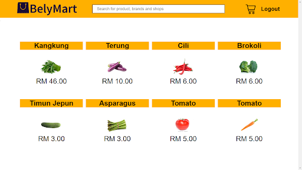
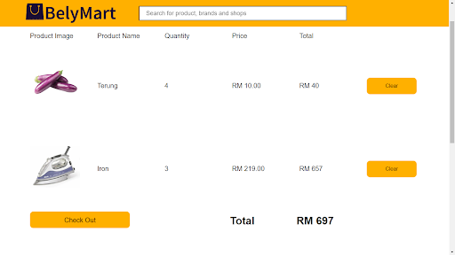
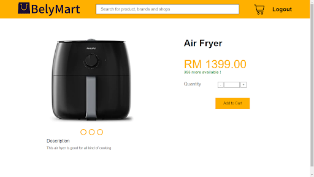
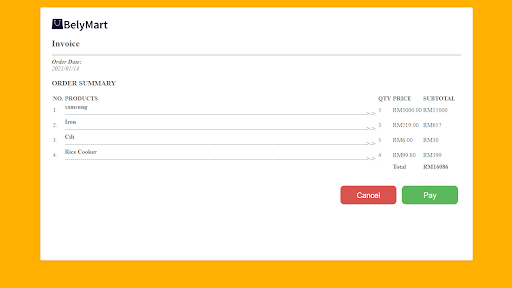

<!-- PROJECT Tittle and description -->

 <h1 align="center">BelyMart
</h1>
  <h3 align="center">An e-commerce application ahtat allows user to buy and sell products online. This project was created using Laravel with HTML/CSS/JS in the front end, PHP for the backEnd and MySql for database</h3>

# Built With

# Preview 

 
 
 
 
 
  

